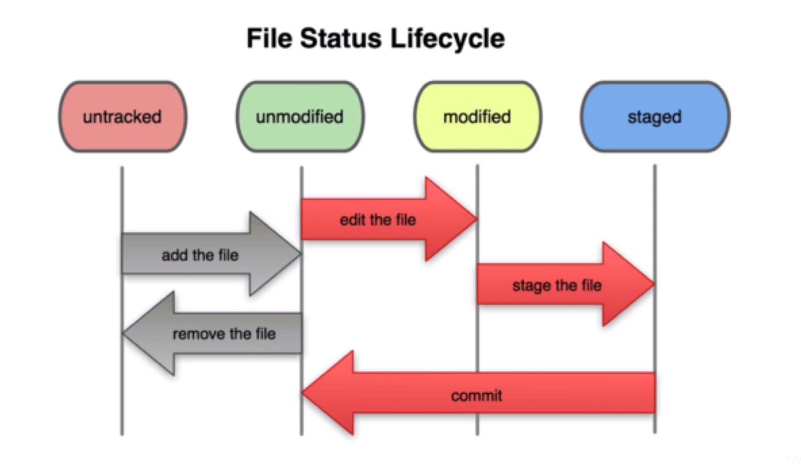

# Git e GitHub

### Salvar versões diferentes de um projeto em disco 
Visa possibilitar o acesso de uma versão anterior desejada. O problema é o espaço ocupado em um disco rígido e a falta de organização compromete a segurança dos dados.

### Controle de versão
Automatiza o gerenciamento de versões de um projeto.

### Software de controle de versão(VCS) centralizado
O usuário sempre está conectado ao servidor que faz o controle de versão.

### VCS distribuído
A versão do projeto não é gerida por um servidor conectado diretamente ao usuário e sim por um software instalado localmente. 

### Git
É um software de controle de versão. É um repositório local.

### Git Hub
Plataforma de rede social para programadores. É um repositório remoto.

### Repositório
É uma pasta onde o projeto é hospedado e divulgado.

### Commit
Ação de enviar diretórios/arquivos monitorado para um repositório central.

